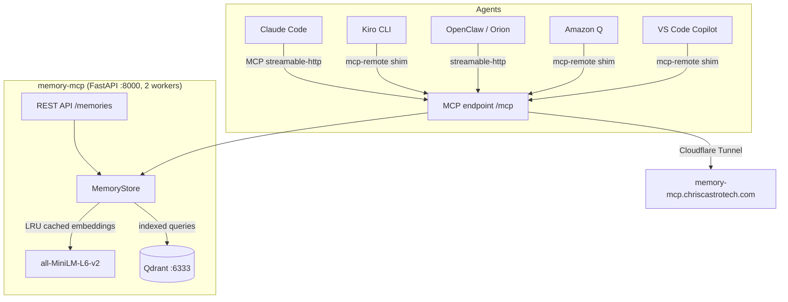

# memory-mcp

A self-hosted [MCP (Model Context Protocol)](https://modelcontextprotocol.io/) server providing **persistent, semantic memory** for AI agents. Uses [Qdrant](https://qdrant.tech/) as the vector store and `all-MiniLM-L6-v2` for embeddings.

[](https://github.com/midcityit/memory-mcp)
[](https://ghcr.io/midcityit/memory-mcp)

---

## Architecture



---

## Features

| Feature | Description |
|---------|-------------|
| **MCP tools** | `save_memory`, `search_memories`, `list_memories`, `delete_memory` via streamable-HTTP transport |
| **REST API** | Full CRUD + semantic search at `/memories` with pagination |
| **Semantic search** | Vector embeddings via `all-MiniLM-L6-v2` — search by meaning, not keywords |
| **Upsert by name** | `save_memory` upserts within a `source_repo` namespace via O(1) indexed lookup |
| **Pagination** | Cursor-based pagination with `limit` and `offset` params on list endpoints |
| **Embedding cache** | LRU cache (512 entries) eliminates redundant model inference for repeated queries |
| **Payload indexes** | Keyword indexes on `name` and `source_repo` for fast filtered lookups |
| **Multi-worker** | 2 uvicorn workers for concurrent request handling |
| **Observability** | OpenTelemetry metrics + traces to OTLP collector; Grafana dashboards via tf-int |
| **Bearer auth** | All endpoints (except `/health`) require `Authorization: Bearer <API_TOKEN>` |
| **Host allowlist** | `MCP_ALLOWED_HOSTS` restricts which hosts can connect to the MCP endpoint |
| **Stale warnings** | Memories older than `STALE_DAYS` get a stale warning annotation |

---

## MCP Tools

Mounted at `/mcp` (streamable HTTP transport, bearer-token protected):

| Tool | Parameters | Description |
|------|-----------|-------------|
| `save_memory` | `type`, `name`, `content`, `source_repo?`, `agent?`, `tags?` | Upsert a memory by name + source_repo (O(1) dedup via indexed lookup) |
| `search_memories` | `query`, `limit?`, `filter_type?`, `filter_source_repo?` | Semantic vector search with cached embeddings |
| `list_memories` | `type?`, `source_repo?`, `agent?`, `tags?`, `limit?`, `offset?` | Paginated filtered list (default limit: 1000) |
| `delete_memory` | `memory_id` | Delete a memory by UUID |

### Pagination

`list_memories` supports cursor-based pagination:
- **`limit`** (default: 1000) — max records per page
- **`offset`** (optional) — cursor from previous response's `next_offset`
- Response includes `next_offset` when more results are available

```
# First page
list_memories(source_repo="global", limit=100)
→ {"memories": [...], "next_offset": "abc-123"}

# Next page
list_memories(source_repo="global", limit=100, offset="abc-123")
→ {"memories": [...]}  # no next_offset = last page
```

### Agent Usage Guidelines

When integrating memory-twin into an agent:

1. **On session start** — call `search_memories` with context relevant to the current task/repo
2. **Use `source_repo`** — always set to the current repository name (e.g., `infra-tf`) or `"global"` for cross-project context
3. **Upsert, don't duplicate** — `save_memory` with the same `name` + `source_repo` updates the existing memory (no duplicates created)
4. **Use meaningful types** — `architecture`, `decision`, `runbook`, `reference`, `project_state`, `troubleshooting`
5. **Tag liberally** — tags enable filtered retrieval; use repo names, technologies, and topic keywords
6. **Set agent identity** — use the `agent` param to identify which tool created the memory (e.g., `kiro-cli`, `claude-code`, `copilot`)
7. **Default limit is 1000** — all memories are returned unless you explicitly set a lower limit
8. **Pagination** — for very large collections, use `limit` + `offset` to page through results

---

## REST API

All endpoints (except `/health`) require `Authorization: Bearer <API_TOKEN>`.

| Method | Path | Query Params | Description |
|--------|------|-------------|-------------|
| `GET` | `/health` | — | Health check (no auth) |
| `GET` | `/memories` | `type`, `source_repo`, `agent`, `tags`, `limit`, `offset` | Paginated list with filters |
| `GET` | `/memories/{id}` | — | Fetch a single memory by UUID |
| `POST` | `/memories/search` | — | Semantic search: `{"query": "...", "limit": 10}` |
| `POST` | `/memories` | — | Save / upsert a memory |
| `PATCH` | `/memories/{id}` | — | Update fields on an existing memory |
| `DELETE` | `/memories/{id}` | — | Delete a memory by UUID |

### Pagination (REST)

```bash
# Get all memories (up to default limit of 1000)
curl -H "Authorization: Bearer TOKEN" https://memory-mcp.chriscastrotech.com/memories

# Paginate with explicit limit
curl -H "Authorization: Bearer TOKEN" "https://memory-mcp.chriscastrotech.com/memories?limit=50"
# Response: {"memories": [...], "next_offset": "uuid-cursor"}

# Next page
curl -H "Authorization: Bearer TOKEN" "https://memory-mcp.chriscastrotech.com/memories?limit=50&offset=uuid-cursor"
```

---

## Deployment

### Docker Compose (single instance)

```yaml
services:
  qdrant:
    image: qdrant/qdrant:v1.13.6
    volumes:
      - qdrant_data:/qdrant/storage

  memory-mcp:
    image: ghcr.io/midcityit/memory-mcp:latest
    ports:
      - "8000:8000"
    environment:
      QDRANT_URL: http://qdrant:6333
      API_TOKEN: your-secret-token
      STALE_DAYS: "30"
      DEFAULT_LIST_LIMIT: "1000"
      MCP_ALLOWED_HOSTS: "localhost,memory-mcp.chriscastrotech.com"
      OTLP_ENDPOINT: ""  # leave empty to disable telemetry
    depends_on:
      - qdrant

volumes:
  qdrant_data:
```

### Kubernetes (ms01-k8s)

Production deployment managed by Terraform in [`tf-int`](https://github.com/midcityit/tf-int):

| Namespace | Purpose | TF File |
|-----------|---------|---------|
| `digital-twin` | Personal/cctech production | `digital-twin.tf` |
| `digital-twin-dev` | Dev/testing instance | manual (kubectl) |
| `ziese-memory` | Ziese client (HA, 2 replicas) | `kubernetes-ziese-memory.tf` |

Key details:
- **Image:** `ghcr.io/midcityit/memory-mcp:latest` (prod) / `:dev` (dev)
- **Workers:** 2 (requires 2Gi memory limit)
- **Qdrant:** StatefulSet with persistent storage (hostPath or qnap-iscsi PVC)
- **Ingress:** nginx-ingress → Cloudflare Tunnel → `memory-mcp.chriscastrotech.com`
- **Secrets:** Azure Key Vault → k8s Secrets via Terraform

---

## Configuration Reference

| Env Var | Required | Default | Description |
|---------|----------|---------|-------------|
| `QDRANT_URL` | ✅ | — | Qdrant HTTP URL, e.g. `http://qdrant:6333` |
| `API_TOKEN` | ✅ | — | Bearer token for all authenticated endpoints |
| `STALE_DAYS` | ❌ | `30` | Days before memories get stale warning |
| `DEFAULT_LIST_LIMIT` | ❌ | `1000` | Default max records returned by list endpoint |
| `MCP_ALLOWED_HOSTS` | ❌ | `localhost` | Comma-separated allowed hosts for MCP transport |
| `OTLP_ENDPOINT` | ❌ | `http://otel-collector.monitoring.svc.cluster.local:4317` | OTLP gRPC endpoint; empty string disables |

---

## CI/CD

### Branches & Tags

| Branch | Trigger | Image Tag |
|--------|---------|-----------|
| `main` | push | `:latest` + `:SHA` |
| `dev` | push | `:dev` + `:SHA` |
| PR → main/dev | pull_request | CI tests only (no push) |

### Runners

Self-hosted on ms01-k8s (`[self-hosted, linux, homelab]`) with Docker-in-Docker sidecar for image builds. Runner image: `ghcr.io/midcityit/docker-runner:latest` (Ubuntu 24.04).

---

## Agent Integration

### Claude Code (`~/.claude.json`)
```json
{
  "mcpServers": {
    "memory-twin": {
      "type": "http",
      "url": "https://memory-mcp.chriscastrotech.com/mcp/",
      "headers": {
        "Authorization": "Bearer YOUR_TOKEN"
      }
    }
  }
}
```

### Kiro CLI (`~/.kiro/settings/mcp.json`)
```json
{
  "mcpServers": {
    "memory-twin": {
      "command": "npx",
      "args": [
        "-y", "mcp-remote",
        "https://memory-mcp.chriscastrotech.com/mcp/",
        "--header", "Authorization: Bearer YOUR_TOKEN"
      ]
    }
  }
}
```

### Amazon Q Developer (`~/.aws/amazonq/mcp.json`)
```json
{
  "mcpServers": {
    "memory-twin": {
      "command": "npx",
      "args": [
        "-y", "mcp-remote",
        "https://memory-mcp.chriscastrotech.com/mcp/",
        "--header", "Authorization: Bearer YOUR_TOKEN"
      ]
    }
  }
}
```

### VS Code Copilot (`~/Library/Application Support/Code/User/mcp.json`)
```json
{
  "servers": {
    "memory-twin": {
      "type": "http",
      "url": "https://memory-mcp.chriscastrotech.com/mcp/",
      "headers": {
        "Authorization": "Bearer YOUR_TOKEN"
      }
    }
  }
}
```

---

## Performance

### Architecture

- **Payload indexes** on `name` and `source_repo` fields — O(1) filtered lookups via Qdrant keyword index
- **LRU embedding cache** (512 entries) — repeated queries skip model inference entirely
- **O(1) upsert dedup** — `find_by_name()` uses indexed scroll instead of listing all records
- **2 uvicorn workers** — concurrent request handling (requires 2Gi memory for dual model copies)

### Benchmarks (2026-07-09)

| Operation | Latency (local) | Latency (remote via CF tunnel) |
|-----------|----------------|-------------------------------|
| Health check | <5ms | ~90ms |
| Semantic search | 22–33ms | ~100ms |
| Save (upsert) | ~150ms | ~150ms |
| List (351 records) | ~30ms | ~200ms |

---

## Observability

OpenTelemetry instrumentation exports metrics and traces to an OTLP-compatible collector.

### Metrics

| Metric | Type | Description |
|--------|------|-------------|
| `memory_mcp_upsert_total` | counter | Total upserts |
| `memory_mcp_search_duration_seconds` | histogram | Search latency |
| `memory_mcp_memory_count` | gauge | Total memories stored |
| `http_server_request_duration_seconds` | histogram | HTTP request latency (auto) |

### Grafana Dashboards

Provisioned via Terraform (`tf-int/dev/grafana-dashboard-memory-mcp.tf`):
1. **memory-mcp Overview** — request rate, latency p50/p95/p99, error rate, memory count
2. **Qdrant** — collection size, vector count, indexing queue, query latency

Access: <https://grafana.chriscastrotech.com>

---

## Development

```bash
git clone https://github.com/midcityit/memory-mcp && cd memory-mcp
python -m venv .venv && source .venv/bin/activate
pip install -e ".[dev]"

export QDRANT_URL="http://localhost:6333"
export API_TOKEN="dev-token"

docker run -p 6333:6333 qdrant/qdrant
uvicorn memory_mcp.server:create_app --factory --host 0.0.0.0 --port 8000 --reload
pytest -v
```

### Dev Instance (ms01-k8s)

A dev instance runs in the `digital-twin-dev` namespace:
- **NodePort:** 30802 (`http://172.16.0.209:30802`)
- **Image:** `ghcr.io/midcityit/memory-mcp:dev`
- **Qdrant:** ephemeral (emptyDir — data lost on restart)
- **Restore backup:** download from `cctechinttf/memory-backups/daily/*.snapshot`, `kubectl cp` to Qdrant pod, call recover API

---

## Runbook

### Token Rotation

1. `openssl rand -hex 32`
2. `az keyvault secret set --vault-name cctech-keyvault --name memory-mcp-api-token --value "NEW_TOKEN"`
3. `cd tf-int/dev && terraform apply -target=kubernetes_secret.memory_mcp`
4. `kubectl rollout restart deployment/memory-mcp -n digital-twin`
5. Update agent configs with the new token.

### Qdrant Backup & Restore

Backups run daily via CronJob → Azure Blob (`cctechinttf/memory-backups/daily/YYYY-MM-DD.snapshot`).

```bash
# Manual snapshot
kubectl exec -n digital-twin qdrant-0 -- \
  curl -X POST http://localhost:6333/collections/memories/snapshots

# Restore from Azure Blob backup
az storage blob download --account-name cctechinttf --container-name memory-backups \
  --name "daily/2026-07-09.snapshot" --file /tmp/backup.snapshot
kubectl cp /tmp/backup.snapshot digital-twin/qdrant-0:/qdrant/storage/backup.snapshot
kubectl exec -n digital-twin qdrant-0 -- \
  curl -X PUT http://localhost:6333/collections/memories/snapshots/recover \
  -H "Content-Type: application/json" \
  -d '{"location": "file:///qdrant/storage/backup.snapshot"}'
```

### Troubleshooting

| Symptom | Fix |
|---------|-----|
| `401 Unauthorized` | Verify Bearer token matches `API_TOKEN` env var |
| MCP connection refused | Check `MCP_ALLOWED_HOSTS` includes the connecting host |
| OOMKilled | Increase memory limit (2Gi minimum with 2 workers) |
| Empty search results | Check Qdrant collection exists and has vectors |
| `list_memories` returns partial results | Check `DEFAULT_LIST_LIMIT` env var; use explicit `limit` param |
| Stale cached image after deploy | Ensure `imagePullPolicy: Always` on deployment |

---

## Related

- **Terraform:** [midcityit/tf-int](https://github.com/midcityit/tf-int) — infrastructure-as-code for all deployments
- **Runner:** [midcityit/docker-runner](https://github.com/midcityit/docker-runner) — self-hosted GitHub Actions runner
- **Jira:** RCL project (RCL-26: performance overhaul)
- **Grafana:** <https://grafana.chriscastrotech.com>
- **Confluence:** [Infrastructure / memory-mcp](https://castrotech.atlassian.net/wiki/spaces/IN/pages/7077897)

---

## Agent Directives (for system prompts and agent configs)

All agents with memory-twin access MUST follow these rules:

```
## Memory-Twin Rules (non-negotiable)

1. SEARCH FIRST — Before starting work on any repo or task, call search_memories
   with relevant keywords. Pull existing context (decisions, runbooks, project state)
   before doing discovery from scratch. Never re-discover what is already known.

2. SAVE AFTER WORK — After completing meaningful work, call save_memory with:
   - Architecture decisions (with rationale)
   - Runbooks and operational procedures
   - Project state and current status
   - Next steps and outstanding work
   - Troubleshooting findings and fixes

3. TRACK ACTIVE PROJECTS — Maintain project_state memories tagged "active-project"
   so any agent or future session can resume without re-discovery.

4. USE source_repo — Always set source_repo to the current repository name
   (e.g., "infra-tf", "tf-int") or "global" for cross-project context.

5. SET agent IDENTITY — Use the agent param to identify yourself
   (kiro-cli, claude-code, copilot, openclaw, cowork, codex).

6. UPSERT, DON'T DUPLICATE — save_memory with the same name + source_repo
   updates the existing memory. Reuse names to keep context current.

Apply these rules every session without being reminded.
```

### Embedding in Agent Configs

Add this to your agent's system prompt or instructions file:

```
You have access to the memory-twin MCP server for persistent memory across sessions.

ON SESSION START:
  search_memories("<current repo or task keywords>")
  search_memories("active-project")

AFTER MEANINGFUL WORK:
  save_memory(type="<appropriate>", name="<descriptive>", content="<findings>",
              source_repo="<repo>", agent="<your-id>", tags=["relevant", "tags"])

IMPORTANT:
- list_memories default limit is 1000 — all memories returned in one call
- Pagination available via limit + offset if needed
- Upsert is O(1) — safe to call save_memory frequently
- search_memories uses semantic search — use natural language queries
```
