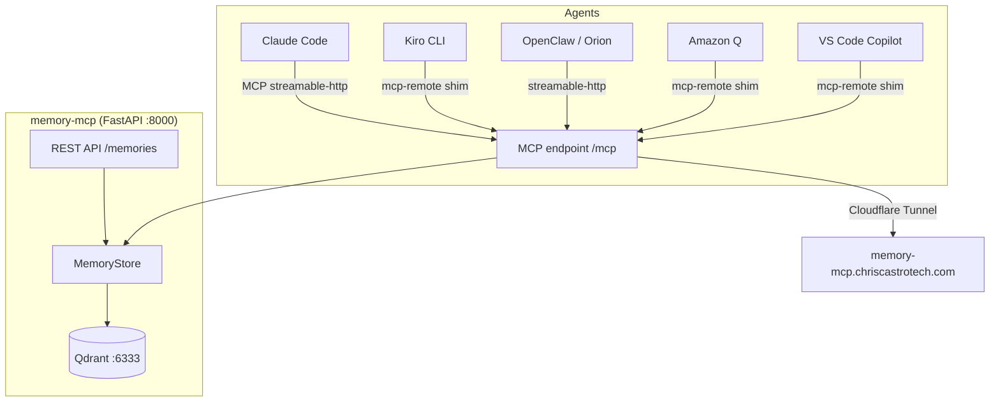

# memory-mcp

A self-hosted [MCP (Model Context Protocol)](https://modelcontextprotocol.io/) server providing **persistent, semantic memory** for AI agents. Uses [Qdrant](https://qdrant.tech/) as the vector store and `all-MiniLM-L6-v2` for embeddings.

[](https://github.com/midcityit/memory-mcp)
[](https://ghcr.io/midcityit/memory-mcp)

---

## Architecture



---

## Features

| Feature | Description |
|---------|-------------|
| **MCP tools** | `save_memory`, `search_memories`, `list_memories`, `delete_memory` via streamable-HTTP transport |
| **REST API** | Full CRUD + semantic search at `/memories` |
| **Web UI** | Extracted to [midcityit/ziese-memory-ui](https://github.com/midcityit/ziese-memory-ui) — deployed via Cloudflare Pages |
| **Semantic search** | Vector embeddings via `all-MiniLM-L6-v2` — search by meaning, not keywords |
| **Upsert by name** | `save_memory` upserts within a `source_repo` namespace; no duplicate memories |
| **Observability** | OpenTelemetry metrics + traces to OTLP collector; Grafana dashboards provisioned via tf-int |
| **Bearer auth** | All endpoints (except `/health`) require `Authorization: Bearer <API_TOKEN>` |
| **Host allowlist** | `MCP_ALLOWED_HOSTS` restricts which hosts can connect to the MCP endpoint |
| **Stale eviction** | Memories older than `STALE_DAYS` are automatically purged |

---

## MCP Tools

Mounted at `/mcp` (streamable HTTP transport, bearer-token protected):

| Tool | Parameters | Description |
|------|-----------|-------------|
| `save_memory` | `type`, `name`, `content`, `source_repo?`, `agent?`, `tags?` | Upsert a memory by name + source_repo |
| `search_memories` | `query`, `limit?`, `filter_type?`, `filter_source_repo?` | Semantic vector search |
| `list_memories` | `type?`, `source_repo?`, `agent?`, `tags?` | Filtered list of memories |
| `delete_memory` | `memory_id` | Delete a memory by UUID |

---

## REST API

All endpoints (except `/health`) require `Authorization: Bearer <API_TOKEN>`.

| Method | Path | Description |
|--------|------|-------------|
| `GET` | `/health` | Health check — no auth required |
| `GET` | `/memories` | List memories; query params: `type`, `source_repo`, `agent`, `tags` (comma-separated) |
| `GET` | `/memories/{id}` | Fetch a single memory by UUID |
| `POST` | `/memories/search` | Semantic search: `{"query": "...", "limit": 10}` |
| `POST` | `/memories` | Save / upsert a memory |
| `PATCH` | `/memories/{id}` | Update fields on an existing memory |
| `DELETE` | `/memories/{id}` | Delete a memory by UUID |

---

## Deployment

### Docker Compose (single instance)

```yaml
services:
  qdrant:
    image: qdrant/qdrant:latest
    volumes:
      - qdrant_data:/qdrant/storage

  memory-mcp:
    image: ghcr.io/midcityit/memory-mcp:latest
    ports:
      - "8000:8000"
    environment:
      QDRANT_URL: http://qdrant:6333
      API_TOKEN: your-secret-token
      STALE_DAYS: "30"
      MCP_ALLOWED_HOSTS: "localhost,memory-mcp.chriscastrotech.com"
      # Optional OTel
      OTLP_ENDPOINT: http://otel-collector:4317
    depends_on:
      - qdrant


volumes:
  qdrant_data:
```

### Kubernetes (ms01-k8s, namespace `memory-mcp`)

The production deployment is managed by Terraform in [`tf-int`](https://github.com/midcityit/tf-int) — see `kubernetes-ziese-memory.tf`.

Key details:
- **Namespace:** `memory-mcp` (personal) / `ziese-memory` (Ziese client)
- **Replicas:** 2 (HA)
- **Qdrant:** StatefulSet with `qnap-iscsi` PVC for persistent storage
- **Ingress:** nginx-ingress → Cloudflare Tunnel → `memory-mcp.chriscastrotech.com`
- **Secrets:** Pulled from Azure Key Vault via Terraform

To deploy a new version:
```bash
cd tf-int/dev
terraform plan -target=kubernetes_deployment.memory_mcp
terraform apply -target=kubernetes_deployment.memory_mcp
```

---

## Configuration Reference

| Env Var | Required | Default | Description |
|---------|----------|---------|-------------|
| `QDRANT_URL` | ✅ | — | Qdrant gRPC/HTTP URL, e.g. `http://qdrant:6333` |
| `API_TOKEN` | ✅ | — | Bearer token for all authenticated endpoints |
| `STALE_DAYS` | ❌ | `30` | Days before unused memories are evicted |
| `MCP_ALLOWED_HOSTS` | ❌ | `localhost` | Comma-separated allowed hosts for MCP transport security |
| `OTLP_ENDPOINT` | ❌ | `http://otel-collector.monitoring.svc.cluster.local:4317` | OpenTelemetry OTLP gRPC endpoint; leave unset to disable telemetry |
| `MCP_URL` | ❌ (UI only) | `http://localhost:8000` | URL of the memory-mcp API (used by the separate [ziese-memory-ui](https://github.com/midcityit/ziese-memory-ui) container) |

---

## Agent Integration

### Claude Code (`~/.claude/settings.json`)
```json
{
  "mcpServers": {
    "memory-twin": {
      "type": "http",
      "url": "https://memory-mcp.chriscastrotech.com/mcp",
      "headers": {
        "Authorization": "Bearer YOUR_TOKEN"
      }
    }
  }
}
```

### Kiro CLI (uses `mcp-remote` shim)
```json
{
  "mcpServers": {
    "memory-twin": {
      "command": "npx",
      "args": [
        "mcp-remote",
        "https://memory-mcp.chriscastrotech.com/mcp",
        "--header",
        "Authorization: Bearer YOUR_TOKEN"
      ]
    }
  }
}
```

### OpenClaw / Orion

Configured in OpenClaw as the `memory-twin` MCP server via streamable-HTTP transport. See the OpenClaw config for exact connection details.

### Amazon Q Developer

```json
{
  "mcpServers": {
    "memory-twin": {
      "command": "npx",
      "args": [
        "mcp-remote",
        "https://memory-mcp.chriscastrotech.com/mcp",
        "--header",
        "Authorization: Bearer YOUR_TOKEN"
      ]
    }
  }
}
```

### VS Code Copilot (`.vscode/mcp.json`)
```json
{
  "servers": {
    "memory-twin": {
      "type": "http",
      "url": "https://memory-mcp.chriscastrotech.com/mcp",
      "headers": {
        "Authorization": "Bearer YOUR_TOKEN"
      }
    }
  }
}
```

---

## Observability

memory-mcp ships OpenTelemetry instrumentation that exports metrics and traces to an OTLP-compatible collector.

### Metrics

| Metric | Type | Source |
|--------|------|--------|
| `http_server_request_duration_seconds` | histogram | FastAPIInstrumentor (auto) |
| `http_server_active_requests` | gauge | FastAPIInstrumentor (auto) |
| `memory_mcp_upsert_total` | counter | store.py (custom) |
| `memory_mcp_search_duration_seconds` | histogram | store.py (custom) |
| `memory_mcp_memory_count` | gauge | store.py (observable, polls Qdrant) |
| `qdrant_*` | various | Qdrant native `/metrics` (scraped by collector) |

### Grafana Dashboards

Two dashboards are provisioned via Terraform (`tf-int/dev/grafana-dashboard-memory-mcp.tf`):

1. **memory-mcp Overview** — HTTP request rate, latency percentiles (p50/p95/p99), 5xx error rate, memory count, upsert rate
2. **Qdrant** — collection size, vector count, indexing queue, query latency

Access at: <https://grafana.chriscastrotech.com>

### Alerts

Azure Monitor Prometheus alert rules (`tf-int/dev/azure-monitor-memory-mcp-alerts.tf`):

| Alert | Condition | Severity |
|-------|-----------|----------|
| `MemoryMcpHighErrorRate` | >5% 5xx over 5 min | 2 |
| `MemoryMcpHighLatency` | p95 > 2s over 5 min | 2 |
| `QdrantDown` | No metrics for 5 min | 1 |

---

## Development

```bash
# Clone
git clone https://github.com/midcityit/memory-mcp
cd memory-mcp

# Create venv and install with dev extras
python -m venv .venv && source .venv/bin/activate
pip install -e ".[dev]"

# Set required env vars
export QDRANT_URL="http://localhost:6333"
export API_TOKEN="dev-token"

# Start Qdrant (Docker)
docker run -p 6333:6333 qdrant/qdrant

# Run the server
uvicorn memory_mcp.server:app --host 0.0.0.0 --port 8000 --reload

# Run tests
pytest
```

### Docker

```bash
docker build -t memory-mcp .
docker run -e QDRANT_URL=http://qdrant:6333 -e API_TOKEN=secret -p 8000:8000 memory-mcp
```

Published to `ghcr.io/midcityit/memory-mcp:latest` on every push to `main`.

---

## Runbook

### Token Rotation

1. Generate a new token (e.g. `openssl rand -hex 32`)
2. Update the secret in Azure Key Vault:
   ```bash
   az keyvault secret set --vault-name cctech-keyvault --name memory-mcp-api-token --value "NEW_TOKEN"
   ```
3. Apply the Terraform change to rotate the Kubernetes secret:
   ```bash
   cd tf-int/dev && terraform apply -target=kubernetes_secret.memory_mcp
   ```
4. Restart the deployment to pick up the new secret:
   ```bash
   kubectl rollout restart deployment/memory-mcp -n memory-mcp
   ```
5. Update agent configs (Claude Code settings, OpenClaw config, etc.) with the new token.

### Qdrant Backup & Restore

```bash
# Snapshot a collection
curl -X POST http://localhost:6333/collections/memories/snapshots

# List snapshots
curl http://localhost:6333/collections/memories/snapshots

# Restore from snapshot
curl -X PUT "http://localhost:6333/collections/memories/snapshots/recover" \
  -H "Content-Type: application/json" \
  -d '{"location": "file:///qdrant/storage/snapshots/memories/snapshot-name.snapshot"}'
```

For K8s, exec into the Qdrant pod:
```bash
kubectl exec -n memory-mcp qdrant-0 -- \
  curl -X POST http://localhost:6333/collections/memories/snapshots
```

### Upgrade Procedure

1. Check the [GitHub releases](https://github.com/midcityit/memory-mcp/releases) or latest `main` SHA
2. Update the image tag in `tf-int/dev/kubernetes-ziese-memory.tf` (or whichever namespace TF file)
3. Run `terraform plan` and review the diff — should only show image tag change
4. `terraform apply` — Kubernetes will perform a rolling update
5. Monitor rollout: `kubectl rollout status deployment/memory-mcp -n memory-mcp`
6. Check Grafana dashboards for error spikes post-deploy

### Troubleshooting

| Symptom | Check |
|---------|-------|
| `401 Unauthorized` from MCP | Verify `Authorization: Bearer TOKEN` header and that token matches `API_TOKEN` env var |
| MCP connection refused | Check `MCP_ALLOWED_HOSTS` includes the connecting host |
| Qdrant not available | Verify `QDRANT_URL` is reachable; check Qdrant pod status |
| Empty search results | Qdrant collection may be empty or embeddings not loaded yet |
| High memory usage | `all-MiniLM-L6-v2` loads ~90MB model; expect ~200–300MB per replica |

---

## Related

- **Terraform:** [midcityit/tf-int](https://github.com/midcityit/tf-int) — infrastructure-as-code for all deployments
- **Jira:** RCL project — feature roadmap (RCL-21: Next.js UI rewrite)
- **Grafana:** <https://grafana.chriscastrotech.com> — dashboards
- **Confluence:** [Infrastructure / memory-mcp product page](https://castrotech.atlassian.net/wiki/spaces/IN/pages/7077897)
